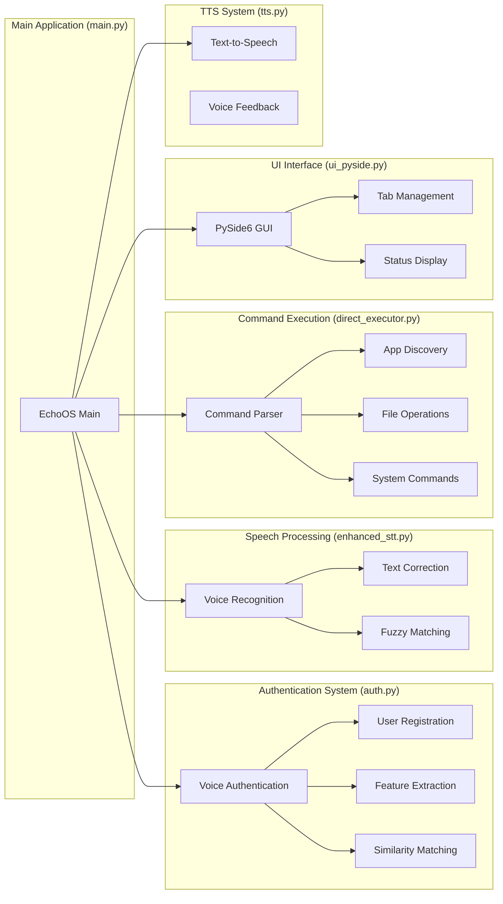

# EchoOS Component Architecture

```mermaid
graph LR
    subgraph "Main Application (main.py)"
        A[EchoOS Main]
    end
    
    subgraph "Authentication System (auth.py)"
        B[Voice Authentication]
        C[User Registration]
        D[Feature Extraction]
        E[Similarity Matching]
    end
    
    subgraph "Speech Processing (enhanced_stt.py)"
        F[Voice Recognition]
        G[Text Correction]
        H[Fuzzy Matching]
    end
    
    subgraph "Command Execution (direct_executor.py)"
        I[Command Parser]
        J[App Discovery]
        K[File Operations]
        L[System Commands]
    end
    
    subgraph "UI Interface (ui_pyside.py)"
        M[PySide6 GUI]
        N[Tab Management]
        O[Status Display]
    end
    
    subgraph "TTS System (tts.py)"
        P[Text-to-Speech]
        Q[Voice Feedback]
    end
    
    A --> B
    A --> F
    A --> I
    A --> M
    A --> P
    
    B --> C
    B --> D
    B --> E
    
    F --> G
    F --> H
    
    I --> J
    I --> K
    I --> L
    
    M --> N
    M --> O
```

## How to Use:
1. Copy the mermaid code above
2. Go to https://mermaid.live/
3. Paste the code
4. Click "Download PNG" or "Download SVG"

